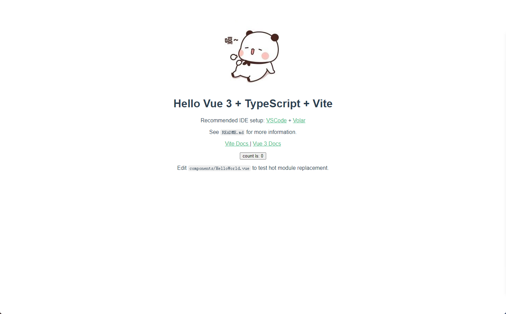

# Vite-Vue3-TypeScript

- 架构搭建
- 代码规范
- 提交规范
- 单元测试
- 自动部署

一套规范的 Vite + Vue3 + TypeScript 前端工程化项目环境

##  技术栈

- 编程语言：TypeScript 4.x + JavaScript
- 构建工具：Vite 2.x
- 前端框架：Vue 3.x
- 路由工具：Vue Router 4.x
- 状态管理：Vuex 4.x
- UI 框架：Element Plus
- CSS 预编译：Stylus / Sass / Less
- HTTP 工具：Axios
- Git Hook 工具：husky + lint-staged
- 代码规范：EditorConfig + Prettier + ESLint + Airbnb JavaScript Style Guide
- 提交规范：Commitizen + Commitlint
- 单元测试：vue-test-utils + jest + vue-jest + ts-jest
- 自动部署：GitHub Actions

## 架构搭建

请确保你的电脑上成功安装 Node.js，本项目使用 Vite 构建工具，需要 Node.js 版本 >= 12.0.0。

查看 Node.js 版本：

```js
node -v
// v14.17.3
```

### 使用 Vite 快速初始化项目雏形

使用 NPM：

```js
npm init @vitejs/app
```

复制代码

使用 Yarn：

```js
yarn create @vitejs/app
```

```js
vue --version
@vue/cli 4.5.13
```

## 搭建第一个 Vite 项目

使用 NPM:

```js
$ npm create vite@latest
```

使用 Yarn:

```js
$ yarn create vite
```

使用 PNPM:

```js
$ pnpm create vite
```

然后按照提示操作即可！

1. 输入项目名称

例如：本项目名称 Vite-Vue3-TypeScript

2. 选择模板

本项目需要使用 Vue3 + TypeScript，所以我们选择 vue-ts，会自动安装 Vue3 和 TypeScript。

你还可以通过附加的命令行选项直接指定项目名和模板，本项目要构建 Vite + Vue3 + TypeScript 项目，则运行：

```js
# npm 6.x
npm init @vitejs/app vite-vue3-starter --template vue-ts

# npm 7+（需要额外的双横线）
npm init @vitejs/app vite-vue3-starter -- --template vue-ts

# yarn
yarn create @vitejs/app vite-vue3-starter --template vue-ts
```

3. 安装依赖

```js
npm install
```

4. 启动项目

```js
npm run dev
```

## 截图

)

如上图，表示 Vite + Vue3 + TypeScript 简单的项目骨架搭建完毕，下面我们来为这个项目集成 Vue Router、Vuex、Element Plus、Axios、Stylus/Sass/Less。

## 修改 Vite 配置文件

Vite 配置文件 vite.config.ts 位于根目录下，项目启动时会自动读取。

本项目先做一些简单配置，例如：设置 @ 指向 src 目录、 服务启动端口、打包路径、代理等。

## 规范目录结构

```js
├── publish/
└── src/
    ├── assets/                    // 静态资源目录
    ├── common/                    // 通用类库目录
    ├── components/                // 公共组件目录
    ├── router/                    // 路由配置目录
    ├── store/                     // 状态管理目录
    ├── style/                     // 通用 CSS 目录
    ├── utils/                     // 工具函数目录
    ├── views/                     // 页面组件目录
    ├── App.vue
    ├── main.ts
    ├── shims-vue.d.ts
├── tests/                         // 单元测试目录
├── index.html
├── tsconfig.json                  // TypeScript 配置文件
├── vite.config.ts                 // Vite 配置文件
└── package.json
```

## 集成路由工具 Vue Router

1. 安装支持 Vue3 的路由工具 vue-router@4

```js
npm i vue-router@4
```

2. 创建 src/router/index.ts 文件

3. 在 main.ts 文件中挂载路由配置

## 集成状态管理工具 Vuex

1. 安装支持 Vue3 的状态管理工具 vuex@next

```js
npm i vuex@next
```

2. 创建 src/store/index.ts 文件

3. 在 main.ts 文件中挂载 Vuex 配置

## 集成 UI 框架 Element Plus

1. 安装支持 Vue3 的 UI 框架 Element Plus

```js
npm i element-plus
```

2. 在 main.ts 文件中挂载 Element Plus

## 集成 HTTP 工具 Axios

1. 安装 Axios（Axios 跟 Vue 版本没有直接关系，安装最新即可）

```js
npm i axios
```

## 集成 CSS 预编译器 Stylus/Sass/Less

本项目使用 CSS 预编译器 Stylus，直接安装为开发依赖即可。Vite 内部已帮我们集成了相关的 loader，不需要额外配置。同理，你也可以使用 Sass 或 Less 等。

1. 安装

```js
npm i stylus -D
# or
npm i sass -D
npm i less -D
```

至此，一个基于 TypeScript + Vite + Vue3 + Vue Router + Vuex + Element Plus + Axios + Stylus/Sass/Less 的前端项目开发环境搭建完毕

项目集合了Stylus/Sass/Less等，如只是需要Sass，可以在依赖中删除，只其它依赖，然后使用 yarn install

## 打磨这个项目

增加代码规范约束、提交规范约束、单元测试、自动部署等，让其更完善、更健壮。

## 代码规范

随着前端应用逐渐变得大型化和复杂化，在同一个项目中有多个人员参与时，每个人的前端能力程度不等，他们往往会用不同的编码风格和习惯在项目中写代码，长此下去，势必会让项目的健壮性越来越差。解决这些问题，理论上讲，口头约定和代码审查都可以，但是这种方式无法实时反馈，而且沟通成本过高，不够灵活，更关键的是无法把控。不以规矩，不能成方圆，我们不得不在项目使用一些工具来约束代码规范。

本文讲解如何使用 EditorConfig + Prettier + ESLint 组合来实现代码规范化。

## 这样做带来好处：

1. 解决团队之间代码不规范导致的可读性差和可维护性差的问题。
2. 解决团队成员不同编辑器导致的编码规范不统一问题。
3. 提前发现代码风格问题，给出对应规范提示，及时修复。
4. 减少代码审查过程中反反复复的修改过程，节约时间。
5. 自动格式化，统一编码风格，从此和脏乱差的代码说再见。

## 集成 EditorConfig 配置

EditorConfig 有助于为不同 IDE 编辑器上处理同一项目的多个开发人员维护一致的编码风格。

在项目根目录下增加 .editorconfig 文件：

VSCode 使用 EditorConfig 需要去插件市场下载插件 EditorConfig for VS Code 。

## 集成 Prettier 配置

Prettier 是一款强大的代码格式化工具，支持 JavaScript、TypeScript、CSS、SCSS、Less、JSX、Angular、Vue、GraphQL、JSON、Markdown 等语言，基本上前端能用到的文件格式它都可以搞定，是当下最流行的代码格式化工具。

1. 安装 Prettier

```js
npm i prettier -D
```

2. 创建 Prettier 配置文件

3. 配置 .prettierrc

4. Prettier 安装且配置好之后，就能使用命令来格式化代码

```js
# 格式化所有文件（. 表示所有文件）
npx prettier --write .
```

VSCode 编辑器使用 Prettier 配置需要下载插件 Prettier - Code formatter 。

## 集成 ESLint 配置

ESLint 是一款用于查找并报告代码中问题的工具，并且支持部分问题自动修复。其核心是通过对代码解析得到的 AST（Abstract Syntax Tree 抽象语法树）进行模式匹配，来分析代码达到检查代码质量和风格问题的能力。

1. 安装 ESLint (推荐本地安装，只在当前项目中安装)

```js
npm i eslint -D
```

2. 配置 ESLint

ESLint 安装成功后，执行 npx eslint --init，然后按照终端操作提示完成一系列设置来创建配置文件。

How would you like to use ESLint? （你想如何使用 ESLint?）

我们这里选择 To check syntax, find problems, and enforce code style（检查语法、发现问题并强制执行代码风格）

What type of modules does your project use?（你的项目使用哪种类型的模块?）

我们这里选择 JavaScript modules (import/export)

Which framework does your project use? （你的项目使用哪种框架?）

我们这里选择 Vue.js

Does your project use TypeScript?（你的项目是否使用 TypeScript？）

我们这里选择 Yes

Where does your code run?（你的代码在哪里运行?）

我们这里选择 Browser 和 Node（按空格键进行选择，选完按回车键确定）

How would you like to define a style for your project?（你想怎样为你的项目定义风格？）

我们这里选择 Use a popular style guide（使用一种流行的风格指南）

Which style guide do you want to follow?（你想遵循哪一种风格指南?）

我们这里选择

ESLint 为我们列出了三种社区流行的 JavaScript 风格指南，分别是 Airbnb、Standard、Google。

What format do you want your config file to be in?（你希望你的配置文件是什么格式?）

我们这里选择 JavaScript

Would you like to install them now with npm?（你想现在就用 NPM 安装它们吗?）

根据上面的选择，ESLint 会自动去查找缺失的依赖，我们这里选择 Yes，使用 NPM 下载安装这些依赖包。

注意：如果自动安装依赖失败，那么需要手动安装

```js
npm i @typescript-eslint/eslint-plugin @typescript-eslint/parser eslint-config-airbnb-base eslint-plugin-import eslint-plugin-vue -D
```

3. ESLint 配置文件 .eslintrc.js

VSCode 使用 ESLint 配置文件需要去插件市场下载插件 ESLint 。

## 解决 Prettier 和 ESLint 的冲突

本项目中的 ESLint 配置中使用了 Airbnb JavaScript 风格指南校验，其规则之一是代码结束后面要加分号，而我们在 Prettier 配置文件中加了代码结束后面不加分号的配置项，这样就有冲突了，会出现用 Prettier 格式化后的代码，ESLint 检测到格式有问题的，从而抛出错误提示。
解决两者冲突问题，需要用到 eslint-plugin-prettier 和 eslint-config-prettier。

eslint-plugin-prettier 将 Prettier 的规则设置到 ESLint 的规则中。

eslint-config-prettier 关闭 ESLint 中与 Prettier 中会发生冲突的规则。

最后形成优先级：Prettier 配置规则 > ESLint 配置规则。

安装插件

```js
npm i eslint-plugin-prettier eslint-config-prettier -D
```

在 .eslintrc.js 添加 prettier 插件

```js
module.exports = {
  ...
  extends: [
    'plugin:vue/essential',
    'airbnb-base',
    'plugin:prettier/recommended' // 添加 prettier 插件
  ],
  ...
}
```

## VSCode怎么打开settings.json文件

1. 点击左下角齿轮图标，选择命令面板
2. 在搜索框输入：settings.json,并选中

VSCode 在 settings.json 设置文件中，增加以下代码：

```js
{
  "editor.codeActionsOnSave": {
    "source.fixAll.eslint": true
 }
}
```

## 集成 husky 和 lint-staged

我们在项目中已集成 ESLint 和 Prettier，在编码时，这些工具可以对我们写的代码进行实时校验，在一定程度上能有效规范我们写的代码，但团队可能会有些人觉得这些条条框框的限制很麻烦，选择视“提示”而不见，依旧按自己的一套风格来写代码，或者干脆禁用掉这些工具，开发完成就直接把代码提交到了仓库，日积月累，ESLint 也就形同虚设。

所以，我们还需要做一些限制，让没通过 ESLint 检测和修复的代码禁止提交，从而保证仓库代码都是符合规范的。

为了解决这个问题，我们需要用到 Git Hook，在本地执行 git commit 的时候，就对所提交的代码进行 ESLint 检测和修复（即执行 eslint --fix），如果这些代码没通过 ESLint 规则校验，则禁止提交。

实现这一功能，我们借助 husky + lint-staged 。

husky —— Git Hook 工具，可以设置在 git 各个阶段（pre-commit、commit-msg、pre-push 等）触发我们的命令。

lint-staged —— 在 git 暂存的文件上运行 linters。

## 配置 husky

自动配置（推荐）

使用 husky-init 命令快速在项目初始化一个 husky 配置。

```js
npx husky-init && npm install
```

这行命令做了四件事：

1. 安装 husky 到开发依赖
2. 在项目根目录下创建 .husky 目录
3. 在 .husky 目录创建 pre-commit hook，并初始化 pre-commit 命令为 npm test
4. 修改 package.json 的 scripts，增加 "prepare": "husky install"

husky 包含很多 hook（钩子），常用有：pre-commit、commit-msg、pre-push。这里，我们使用 pre-commit 来触发 ESLint 命令。

修改 .husky/pre-commit hook 文件的触发命令：

```js
#!/bin/sh
. "$(dirname "$0")/_/husky.sh"

eslint --fix ./src --ext .vue,.js,.ts
```

上面这个 pre-commit hook 文件的作用是：当我们执行 git commit -m "xxx" 时，会先对 src 目录下所有的 .vue、.js、.ts  文件执行 eslint --fix 命令，如果 ESLint 通过，成功 commit，否则终止 commit。

但是又存在一个问题：有时候我们明明只改动了一两个文件，却要对所有的文件执行 eslint --fix。假如这是一个历史项目，我们在中途配置了 ESLint 规则，那么在提交代码时，也会对其他未修改的“历史”文件都进行检查，可能会造成大量文件出现 ESLint 错误，显然不是我们想要的结果。

我们要做到只用 ESLint 修复自己此次写的代码，而不去影响其他的代码。所以我们还需借助一个神奇的工具 lint-staged 。

## 配置 lint-staged

lint-staged 这个工具一般结合 husky 来使用，它可以让 husky 的 hook 触发的命令只作用于 git add那些文件（即 git 暂存区的文件），而不会影响到其他文件。

接下来，我们使用 lint-staged 继续优化项目。

1. 安装 lint-staged

```js
npm i lint-staged -D
```

2. 在 package.json里增加 lint-staged 配置项

只对 git 暂存区的 .vue、.js、.ts 文件执行 eslint --fix。

3. 修改 .husky/pre-commit hook 的触发命令为：npx lint-staged

```js
#!/bin/sh
. "$(dirname "$0")/_/husky.sh"

npx lint-staged
```

至此，husky 和 lint-staged 组合配置完成。

无论写代码还是做其他事情，都应该用长远的眼光来看，刚开始使用 ESint 的时候可能会有很多问题，改起来也很费时费力，只要坚持下去，代码质量和开发效率都会得到提升，前期的付出都是值得的。

## 提交规范

如果 git commit 的描述信息精准，在后期维护和 Bug 处理时会变得有据可查，项目开发周期内还可以根据规范的提交信息快速生成开发日志，从而方便我们追踪项目和把控进度。

提交信息都是有固定格式的

### commit message 格式规范

commit message 由 Header、Body、Footer 组成。

```js
<Header>

<Body>

<Footer>
```

## Header

Header 部分包括三个字段 type（必需）、scope（可选）和 subject（必需）。

```js
<type>(<scope>): <subject>
```

### type

type 用于说明 commit 的提交类型（必须是以下几种之一）。

```js
feat: 新增一个功能
fix: 修复一个Bug
docs: 文档变更
style: 代码格式（不影响功能，列如空格，分号等格式修正）
refactor: 代码重构
perf: 改善性能
test: 测试
build: 变更项目构建或外部依赖（例如：scopes:webpack, gulp, npm等）
ci: 更改持续集成软件的配置文件和package中的scripts命令，例如：scopes: Travis, Circle等
chore: 变更构建流程或辅助工具
revert: 代码回退
```

### scope

scope 用于指定本次 commit 影响的范围。scope 依据项目而定，例如在业务项目中可以依据菜单或者功能模块划分，如果是组件库开发，则可以依据组件划分。（scope 可省略）

### subject

subject 是本次 commit 的简洁描述，长度约定在 50 个字符以内，通常遵循以下几个规范：

- 用动词开头，第一人称现在时表述，例如：change 代替 changed 或 changes
- 第一个字母小写
- 结尾不加句号（.）

## Body

body 是对本次 commit 的详细描述，可以分成多行。（body 可省略）

跟 subject 类似，用动词开头，body 应该说明修改的原因和更改前后的行为对比。

## Footer

如果本次提交的代码是突破性的变更或关闭缺陷，则 Footer 必需，否则可以省略。

- 突破性的变更

当前代码与上一个版本有突破性改变，则 Footer 以 BREAKING CHANGE 开头，后面是对变动的描述、以及变动的理由。

- 关闭缺陷

如果当前提交是针对特定的 issue，那么可以在 Footer 部分填写需要关闭的单个 issue 或一系列 issues。

## 参考例子

- feat

```js
feat(browser): onUrlChange event (popstate/hashchange/polling)

Added new event to browser:
- forward popstate event if available
- forward hashchange event if popstate not available
- do polling when neither popstate nor hashchange available

Breaks $browser.onHashChange, which was removed (use onUrlChange instead)
```

- fix

```js
fix(compile): couple of unit tests for IE9

Older IEs serialize html uppercased, but IE9 does not...
Would be better to expect case insensitive, unfortunately jasmine does
not allow to user regexps for throw expectations.

Closes #392
Breaks foo.bar api, foo.baz should be used instead
```

- style

```js
style(location): add couple of missing semi colons
```

- chore

```js
chore(release): v3.4.2
```

## 规范 commit message 的好处

1. 首行就是简洁实用的关键信息，方便在 git history 中快速浏览。
2. 具有更加详细的 body 和 footer，可以清晰的看出某次提交的目的和影响。
3. 可以通过 type 过滤出想要查找的信息，也可以通过关键字快速查找相关提交。
4. 可以直接从 commit 生成 change log。

## 集成 Commitizen 实现规范提交

Commitizen 是一个帮助撰写规范 commit message 的工具。它有一个命令行工具 cz-cli。

## 安装 Commitizen

```js
npm install commitizen -D
```

## 初始化项目

成功安装 Commitizen 后，我们用 cz-conventional-changelog 适配器来初始化项目：

```js
npx commitizen init cz-conventional-changelog --save-dev --save-exact
```

这行命令做了两件事：

- 安装 cz-conventional-changelog 到开发依赖（devDependencies）
- 在 package.json 中增加了 config.commitizen

```js
"config": {
  "commitizen": {
    "path": "./node_modules/cz-conventional-changelog"
  }
}
```

## 使用 Commitizen

以前我们提交代码都是 git commit -m "xxx"，现在改为 git cz，然后按照终端操作提示，逐步填入信息，就能自动生成规范的 commit message。

最后，在 Git 提交历史中就能看到刚刚规范的提交记录了.

## 自定义配置提交说明

从上面的截图可以看到，git cz 终端操作提示都是英文的，如果想改成中文的或者自定义这些配置选项，我们使用 cz-customizable 适配器。

## cz-customizable 初始化项目

运行如下命令使用 cz-customizable 初始化项目，注意之前已经初始化过一次，这次再初始化，需要加 --force 覆盖。

```js
npx commitizen init cz-customizable --save-dev --save-exact --force
```

这行命令做了两件事：


安装 cz-customizable 到开发依赖（devDependencies）

```js
"devDependencies": {
  ...
  "cz-customizable": "^6.3.0",
  ...
},
```

修改 package.json 中的 config.commitizen 字段为：

```js
"config": {
  "commitizen": {
    "path": "./node_modules/cz-customizable"
  }
}
```

## 使用 cz-customizable

在项目根目录下创建 .cz-config.js 文件

## 集成 commitlint 验证提交规范

在“代码规范”章节，我们已经讲到过，尽管制定了规范，但在多人协作的项目中，总有些人依旧我行我素，因此提交代码这个环节，我们也增加一个限制：只让符合 Angular 规范的 commit message 通过，我们借助 @commitlint/config-conventional 和 @commitlint/cli 来实现。

## 安装 commitlint

安装 @commitlint/config-conventional 和 @commitlint/cli

```js
npm i @commitlint/config-conventional @commitlint/cli -D
```

## 配置 commitlint

## 创建 commitlint.config.js 文件

在项目根目录下创建 commitlint.config.js 文件，并填入以下内容：

```js
module.exports = { extends: ['@commitlint/config-conventional'] }
```

使用 husky 的 commit-msg hook 触发验证提交信息的命令

我们使用 husky 命令在 .husky 目录下创建 commit-msg 文件，并在此执行 commit message 的验证命令。

## commitlint 验证

不符合规范的提交信息

提交信息 test commitlint 不符合规范，提交失败。

符合规范的提交信息

提交信息 test: commitlint test 符合规范，成功提交到仓库。

因为已在项目中集成 commitizen，建议大家用 git cz 来代替 git commit 提交代码，可以保证提交信息规范。

## 单元测试

单元测试是项目开发中一个非常重要的环节，完整的测试能为代码和业务提供质量保证，减少 Bug 的出现。

## 安装核心依赖

我们使用 Vue 官方提供的 vue-test-utils 和社区流行的测试工具 jest 来进行 Vue 组件的单元测试。

- vue-test-utils The next iteration of Vue Test Utils. It targets Vue 3.
- jest Delightful JavaScript Testing.
- vue-jest Jest Vue transformer
- ts-jest A Jest transformer with source map support that lets you use Jest to test projects written in TypeScript.

安装这些工具为开发依赖（devDependencies）：

```js
npm i @vue/test-utils@next jest vue-jest@next ts-jest -D
```

## 创建 jest 配置文件

在项目根目录下新建 jest.config.js 文件：

## 创建单元测试文件

在上面的 `jest.config.js` 文件中，我们配置只匹配 `__tests__` 目录下的任意 .ts 文件或其他目录下的 `xx.test.ts/xx.spec.ts` 文件进行单元测试。

这里，我们在项目根目录下创建 `tests` 目录来存储单元测试文件

```js
├── src/
└── tests/                           // 单元测试目录
    ├── Test.spec.ts                 // Test 组件测试
```

## 集成 @types/jest

使用 VSCode / WebStrom / IDEA 等编辑器时，在单元测试文件中，IDE 会提示某些方法不存在（如 test、describe、it、expect等），安装 @types/jest 即可解决。

```js
npm i @types/jest -D
```

TypeScript 的编译器也会提示 jest 的方法和类型找不到，我们还需把 @types/jest 添加根目录下的 ts.config.json（TypeScript 配置文件）中：

```js
{
  "compilerOptions": {
    ...
    "types": ["vite/client", "jest"]
  },
}
```

## 添加 eslint-plugin-jest

因为我们在项目中集成了 ESLint，如上图很明显是没通过 ESLint 规则检验。因此，我们还需要在 ESLint 中增加 eslint-plugin-jest 插件来解除对 jest 的校验。

安装 eslint-plugin-jest

```js
npm i eslint-plugin-jest -D
```

添加 eslint-plugin-jest 到 ESLint 配置文件 .eslintrc.js 中

```js
module.exports = {
  ...
  extends: [
    ...
    'plugin:jest/recommended'
  ],
  ...
}
```

现在，我们的单元测试代码就不会有错误提示信息了

## 执行单元测试

在根目录下 package.json 文件的 scripts 中，添加一条单元测试命令： "test": "jest"。

执行命令 npm run test 即可进行单元测试，jest 会根据 jest.config.js 配置文件去查找 `__tests__` 目录下的 .ts 文件或其他任意目录下的 .spec.ts 和 .test.ts 文件，然后执行单元测试方法。

你可以在 jest.config.js 配置文件中，自由配置单元测试文件的目录。

当单元测试没有全部通过时，我们需要根据报错信息去优化对应组件的代码，进一步提高项目健壮性。但是写单元测试是件比较痛苦的事，我个人觉得也没必要全部组件都写单元测试，根据项目实际情况有针对性去写就行了。

## 单元测试约束

前面，我们使用 husky 在 Git 的 pre-commit 和 commit-msg 阶段分别约束代码风格规范和提交信息规范。这一步，我们在 pre-push 阶段进行单元测试，只有单元测试全部通过才让代码 push 到远端仓库，否则终止 push。

使用 husky 命令在 .husky 目录下自动创建 pre-push hook 文件，并在此执行单元测试命令 npm run test。

现在，我们在 git push 时就能先进行单元测试了，只有单元测试全部通过，才能成功 push。

## 自动部署

在项目中集成代码规范约束、提交信息规范约束，单元测试约束，从而保证我们远端仓库（如 GitHub、GitLab、Gitee 仓库等）的代码都是高质量的。

使用 CI（Continuous Integration 持续集成）来完成项目最后的部署工作。

常见的 CI 工具有 GitHub Actions、GitLab CI、Travis CI、Circle CI 等。

这里，我们使用 GitHub Actions。

## 什么是 GitHub Actions

GitHub Actions 是 GitHub 的持续集成服务，持续集成由很多操作组成，比如抓取代码、运行测试、登录远程服务器、发布到第三方服务等等，GitHub 把这些操作称为 actions。

## 配置 GitHub Actions

其中，我们用：

- master 分支存储项目源代码
- gh-pages 分支存储打包后的静态文件

gh-pages 分支，是 GitHub Pages 服务的固定分支，可以通过 HTTP 的方式访问到这个分支的静态文件资源。

## 创建 GitHub Token

创建一个有 repo 和 workflow 权限的 GitHub Token

注意：新生成的 Token 只会显示一次，保存起来，后面要用到。如有遗失，重新生成即可。

## 在仓库中添加 secret

新创建的 Token 添加到 GitHub 仓库的 Secrets 里，并将这个新增的 secret 命名为 VUE3_DEPLOY （名字无所谓，看你喜欢）。

步骤：仓库 -> settings -> Secrets -> New repository secret。

新创建的 secret VUE3_DEPLOY 在 Actions 配置文件中要用到，两个地方需保持一致！

## 创建 Actions 配置文件

- 在项目根目录下创建 .github 目录。
- 在 .github 目录下创建 workflows 目录。
- 在 workflows 目录下创建 deploy.yml 文件。

## 自动部署触发原理

当有新提交的代码 push 到 GitHub 仓库时，就会触发 GitHub Actions，在 GitHub 服务器上执行 Action 配置文件里面的命令，例如：安装依赖、项目打包等，然后将打包好的静态文件部署到 GitHub Pages 上，最后，我们就能通过域名访问了。

https://github.com/settings/tokens/new
